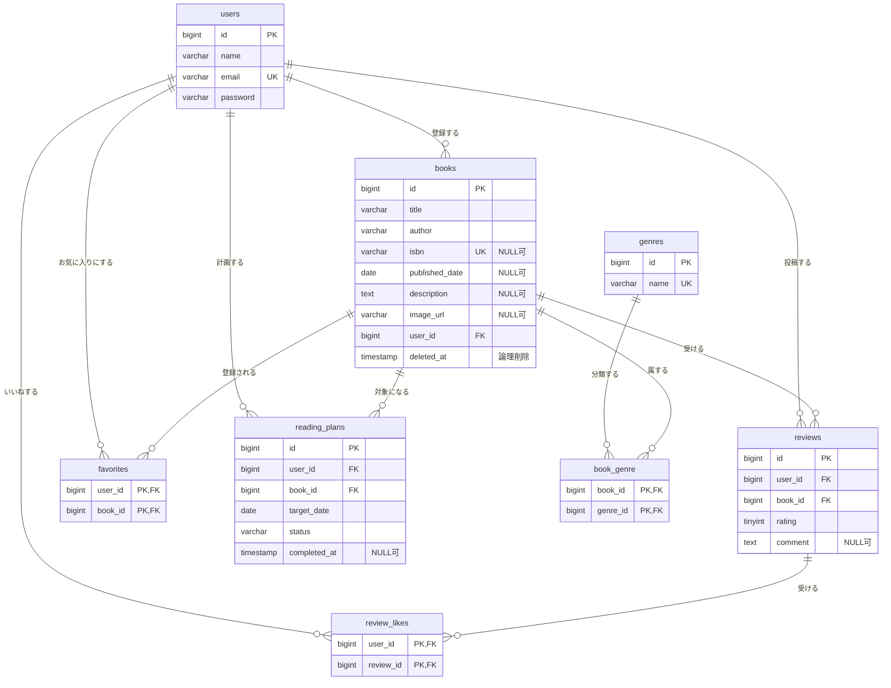

# BookShelf 書籍レビューアプリ

書籍を登録・共有し、レビュー・お気に入り・いいねで評価を集める読書管理アプリです。

## 目次

- [概要](#概要)
- [ER図](#er図)
- [環境構築手順](#環境構築手順)
- [使用技術](#使用技術)
- [テスト](#テスト)
- [APIエンドポイント一覧](#apiエンドポイント一覧)
- [開発環境URL](#開発環境url)
- [作成者](#作成者)

## 概要

### 目的

書籍の情報を利用者同士で共有し、レビュー・お気に入り・いいねを通じて「読む価値のある本」を見つけやすくすることを目的としています。

### 実装した機能

| 区分 | 機能 |
|---|---|
| 認証 | 会員登録・ログイン・ログアウト（Laravel Fortify） |
| 書籍 | 一覧・詳細・登録・編集・削除（論理削除）・復元、ジャンルの登録・編集・削除 |
| 評価 | レビューの投稿・編集・削除、お気に入り、レビューへのいいね、ランキング |
| 検索 | 書籍の検索と並び替え |
| ISBN検索 | ISBNから Google Books API で書誌情報を取得し、登録フォームへ自動入力 |
| 読書計画 | 読書計画の作成・期日変更・読了・削除。期日の3日前・当日・3日後に通知（毎日7:00に実行） |
| 読書レポート | 自分のレビューをもとにしたレポート表示 |
| 公開API | 書籍の一覧・詳細・登録・更新・削除（書き込み系は Sanctum のトークン認証） |

### 利用者の区分

| 区分 | できること |
|---|---|
| ゲスト（未ログイン） | 書籍一覧・書籍詳細・ランキングの閲覧、会員登録・ログイン |
| ログインユーザー | 上記に加え、書籍の登録、レビュー投稿、お気に入り・いいね、ジャンル管理、読書計画、通知、レポート |
| 所有者 | 自分が登録した書籍の編集・削除・復元、自分のレビュー・読書計画の編集・削除など |

## ER図



図には主要なカラムのみを載せています。`created_at`・`updated_at` は省略しています。

### 外部キーと削除時の挙動

| テーブル | 外部キー | 参照先 | 削除時 |
|---|---|---|---|
| books | user_id | users.id | RESTRICT（削除を拒否） |
| book_genre | book_id | books.id | CASCADE（連動削除） |
| book_genre | genre_id | genres.id | RESTRICT（削除を拒否） |
| reviews | user_id | users.id | RESTRICT |
| reviews | book_id | books.id | CASCADE |
| favorites | user_id | users.id | RESTRICT |
| favorites | book_id | books.id | CASCADE |
| review_likes | user_id | users.id | RESTRICT |
| review_likes | review_id | reviews.id | CASCADE |
| reading_plans | user_id | users.id | RESTRICT |
| reading_plans | book_id | books.id | CASCADE |

- 書籍は論理削除のため、削除してもレビュー・お気に入り・読書計画は残ります。CASCADE が働くのは物理削除の場合だけです。
- 紐づく書籍が1件でもあるジャンルは、アプリ側で削除を止めます。
- 上記のほかに、Laravel標準のテーブル（`notifications`・`personal_access_tokens`・`password_reset_tokens`・`failed_jobs`・`migrations`）があります。`notifications` と `personal_access_tokens` は外部キーを持たず、`notifiable_type`・`notifiable_id`（`tokenable_type`・`tokenable_id`）で会員を指します。

## 環境構築手順

Docker と Docker Compose が動く環境（Mac / Linux / Windows は WSL2）で、次の順に実行してください。Laravel Sail を使うため、PHP や MySQL を手元に入れる必要はありません。

### 1. リポジトリを取得する

```bash
git clone https://github.com/kayame0120-code/BookShelf-.git
cd BookShelf-
```

### 2. `.env` を作る

```bash
cp .env.example .env
```

データベース接続情報は `.env.example` のまま使えます。

```
DB_CONNECTION=mysql
DB_HOST=mysql
DB_PORT=3306
DB_DATABASE=laravel
DB_USERNAME=sail
DB_PASSWORD=password
```

`DB_HOST` は `localhost` や `127.0.0.1` ではなく、Dockerのコンテナ名である `mysql` です。

### 3. PHPのパッケージをインストールする

`vendor/` はリポジトリに含まれていないため、Sail が使えるようになるまでは Docker で直接 Composer を実行します。

```bash
docker run --rm -u "$(id -u):$(id -g)" -v "$(pwd):/var/www/html" -w /var/www/html -e COMPOSER_CACHE_DIR=/tmp/composer_cache laravelsail/php82-composer:latest composer install
```

### 4. コンテナを起動する

```bash
./vendor/bin/sail up -d
```

初回はイメージの取得とビルドに時間がかかります。以降、`sail` のコマンドは `./vendor/bin/sail` の代わりに、次のエイリアスを登録すると `sail` だけで実行できます。

```bash
echo "alias sail='[ -f sail ] && bash sail || bash vendor/bin/sail'" >> ~/.zshrc
exec $SHELL
```

（bash を使う場合は `~/.zshrc` を `~/.bashrc` に読み替えてください）

### 5. アプリケーションキーを生成する

```bash
./vendor/bin/sail artisan key:generate
```

### 6. テーブルの作成と初期データの投入

```bash
./vendor/bin/sail artisan migrate --seed
```

やり直す場合は、次のコマンドでデータベースを作り直せます。

```bash
./vendor/bin/sail artisan migrate:fresh --seed
```

### 7. フロントエンドを準備する

```bash
./vendor/bin/sail npm install
./vendor/bin/sail npm run dev
```

`sail npm run dev`（Vite開発サーバー）は、画面を表示している間は起動したままにしてください。

### 8. 動作を確認する

ブラウザで <http://localhost> を開き、書籍一覧が表示されれば完了です。

### 補足

- **ポートが競合する場合**: `.env` に `APP_PORT=8022` のように書くと、アプリの公開ポートを変えられます。変えた場合のURLは `http://localhost:8022` になります。
- **ISBN検索のAPIキー（任意）**: `.env` の `GOOGLE_BOOKS_API_KEY` に Google Books API のキーを設定すると、ISBN検索にキーが付きます。未設定のままでも動作しますが、Google側の回数制限（429）にかかりやすくなります。
- **Apple Silicon（M1/M2/M3）で `no matching manifest for linux/arm64/v8` が出る場合**: `compose.yaml` の `mysql` サービスに `platform: 'linux/amd64'` を追加してください。
- **日本語化**: `lang/ja/` に手動で配置したメッセージファイルを使っています（`laravel-lang/*` 系パッケージは使用していません）。

### 初期データのログイン情報

`migrate --seed` で会員5人・ジャンル10件・書籍11件などが投入されます。会員は全員、パスワードが `password` です。

| 名前 | メールアドレス |
|---|---|
| 山田太郎 | yamada@example.com |
| 鈴木花子 | suzuki@example.com |
| 田中一郎 | tanaka@example.com |
| 佐藤美咲 | sato@example.com |
| 高橋健太 | takahashi@example.com |

## 使用技術

| 分類 | 内容 |
|---|---|
| 言語 | PHP 8.2 |
| フレームワーク | Laravel 10.50 |
| データベース | MySQL 8.4 |
| 認証（画面） | Laravel Fortify（会員登録・ログイン・ログアウト） |
| 認証（API） | Laravel Sanctum（トークン認証） |
| 外部API | Google Books API（ISBN検索） |
| フロントエンド | Blade / Tailwind CSS 3.4 / Alpine.js 3.16 / Vite 5.4 |
| 開発環境 | Docker / Laravel Sail / phpMyAdmin |
| 整形 | Laravel Pint |
| テスト | PHPUnit 10.5 |

## テスト

自動テストは PHPUnit（`tests/Feature/`・`tests/Unit/`）で実装しています。全176件が通過し、カバレッジは97.4%です。

```bash
./vendor/bin/sail artisan test
./vendor/bin/sail artisan test --coverage
./vendor/bin/sail bin pint --test
```

### カバレッジ方針（説明責任ベース）

合格条件はカバレッジの数値ではなく「説明のつかない未カバー行がゼロであること」です（CLAUDE.md 13-A-4）。アプリが使う機能の未カバー行はテストで潰し、残す行は理由付きで除外リストに記載します。

未カバーのまま残している行の一覧と理由は **`docs/04_検品結果/カバレッジ除外リスト.md`** を参照してください。残しているのは次のいずれかに該当する行のみです。

- フレームワークが自動生成し、どのルート・画面からも到達しないコード（`TrustHosts`、`BroadcastServiceProvider`）
- フレームワークの例外変換により到達しないコード（`Handler` の `TokenMismatchException` 用 renderable。419ページ自体は標準のビュー解決で描画され、テストで確認済み）
- 認証の画面描画のうち、テスト対象外としている行（`FortifyServiceProvider` のログイン／登録ビュー）
- バッチのレコード単位の防御的例外ログ（`ExpireReadingPlans` / `SendReadingPlanReminders` の `catch`）。正常・異常いずれの業務条件でも到達しない

除外リストに載っていない未カバー行は存在しません。

## APIエンドポイント一覧

ベースパスは `/api/v1` です。

| No | メソッド | パス | 認証 | 概要 |
|---|---|---|---|---|
| AP01 | GET | `/api/v1/books` | 不要 | 書籍一覧（キーワード・ジャンル・ページ指定） |
| AP02 | GET | `/api/v1/books/{book}` | 不要 | 書籍詳細（レビューを含む） |
| AP03 | POST | `/api/v1/books` | トークン | 書籍登録 |
| AP04 | PUT | `/api/v1/books/{book}` | トークン・所有者 | 書籍更新 |
| AP05 | DELETE | `/api/v1/books/{book}` | トークン・所有者 | 書籍削除（論理削除） |

- 書き込み系（AP03〜AP05）は `Authorization: Bearer <トークン>` ヘッダーが必要です。
- 書籍登録（AP03）の必須項目は `title`・`author`・`isbn`・`published_date`・`genres` です。
- 一覧のページあたり件数は既定10件、指定は1〜100件です。
- エラーはすべてJSONで返します。

| 状況 | ステータス | 本文 |
|---|---|---|
| トークンが無い・無効 | 401 | `{"message": "認証が必要です。"}` |
| 他人の書籍の更新・削除 | 403 | — |
| 存在しない・削除済みの書籍 | 404 | `{"message": "指定された書籍が見つかりません。"}` |
| 入力エラー | 422 | `{"message": "入力内容に誤りがあります。", "errors": {…}}` |

- 呼び出し回数の上限は1分あたり60回です（ログイン中は会員ごと、未ログインはIPごと）。
- 削除に成功すると 204（本文なし）を返します。

### APIトークンの発行（動作確認用）

アプリ内にトークンを発行する画面はありません。書き込み系のAPIを試すときは、次の手順でトークンを発行します。

```bash
./vendor/bin/sail artisan tinker
```

```php
App\Models\User::first()->createToken('動作確認用')->plainTextToken
```

表示された文字列（`1|` から始まるもの）を `Authorization: Bearer <トークン>` として使ってください。tinker は `exit` で終了します。

## 開発環境URL

| 用途 | URL |
|---|---|
| アプリ | <http://localhost> |
| phpMyAdmin | <http://localhost:8080> |
| Vite開発サーバー | <http://localhost:5173> |

## 作成者

片倉 菖（GitHub: [kayame0120-code](https://github.com/kayame0120-code)）
