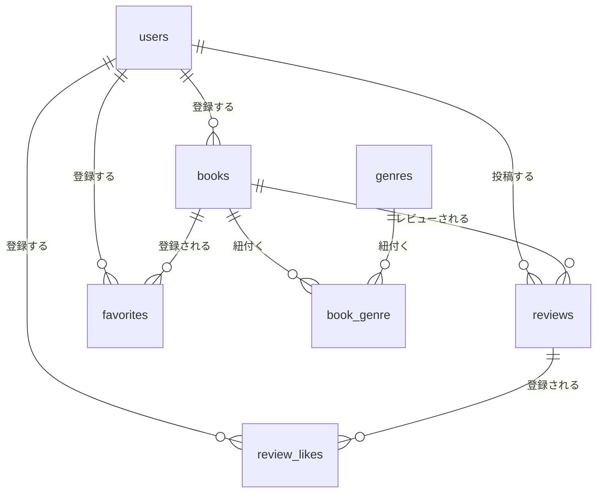

# 機能仕様書 — auth（会員登録・ログイン・ログアウト／土台：全テーブル・全モデル）

| 項目 | 内容 |
|---|---|
| 対象発注書 | 01_土台認証（migration・Model・リレーション・Fortify認証） |
| 正本 | 要件シート.xlsx シート3/4/5/7/8/9/10/11/12 ＋ Bladeモック `basic`（frozen） |
| 適用範囲 | 基本要件のみ。★応用（Sanctum・reading_plans・通知）は第5〜6週に別途 |
| 完成条件 | 本書だけで発注書01が書ける（他ファイル参照不要） |
| 版 | v1（2026-09-01・面談②のSoftDelete確定を反映済み） |

---

## 0. スコープ

本書は認証機能そのものに加え、**アプリ全体の土台**（全テーブルのmigration、全モデルとリレーション、ルート全体像、共通設定）を担う。発注書01はこの1本だけで書けるようになっている。

**含む**: Fortify による会員登録・ログイン・ログアウト、guest/auth ミドルウェア、users テーブル、7テーブル分の migration 一式と作成順、全モデルのリレーション定義、日本語化（lang/ja）、共通設定（locale・timezone）、UserSeeder / DatabaseSeeder、認証と画面アクセスのテスト観点。

**含まない**: 各機能のコントローラー実装（books.md / genres.md / reviews_likes.md / favorites.md / ranking.md）／公開API（public_api.md）。

---

## 1. 認証まわりのルーティング（Fortify管轄）

| メソッド | URI | route名 | 担当 | ミドルウェア |
|---|---|---|---|---|
| GET | `/login` | `login` | Fortify | `guest` |
| POST | `/login` | `login` | Fortify | `guest` |
| GET | `/register` | `register` | Fortify | `guest` |
| POST | `/register` | `register` | Fortify | `guest` |
| POST | `/logout` | `logout` | Fortify | `auth` |

独自の認証コントローラーは作らない。ルートも自分で書かず、Fortify のルート登録に任せる。

### アプリ全体のルート一覧（Web の named route 26本 ＋ API 5本）

| 機能 | named route 本数 | 詳細の所在 |
|---|---|---|
| 書籍（`books.restore` 含む） | 8 | books.md §1 |
| ジャンル | 7 | genres.md §1 |
| レビュー・いいね | 5 | reviews_likes.md §1 |
| お気に入り | 2 | favorites.md §1 |
| ランキング | 1 | ranking.md §1 |
| 認証（Fortify） | 3（`login` `register` `logout`） | 本書 §1 |
| **Web 小計** | **26** | — |
| 公開API（別枠・`api` プレフィックス） | 5 | public_api.md §1 |

Web の物理エンドポイント数は、`/`（無名）と `login` / `register` の GET/POST ペアを数えて 29 本になる。面談①時点の 25 本から増えているのは、面談②で確定した `books.restore` が加わったため。

`/`（ルートパス）は `BookController@index` に束ね、**名前は付けない**（`books.index` と同一アクション）。`welcome.blade.php` はどの `route()` からも参照されない未使用ファイルであり、ルート定義の対象外とする。

---

## 2. Fortify の設定

### 2-1. 有効化する機能

`config/fortify.php` の `features` 配列に残すのは `Features::registration()` **のみ**。以下は対応する Blade が提供物に存在しないため削除する。

- `Features::resetPasswords()`
- `Features::emailVerification()`
- `Features::updateProfileInformation()`
- `Features::updatePasswords()`
- `Features::twoFactorAuthentication()`

ログイン／ログアウトは Fortify のコア機能であり `features` 配列の管理対象外なので、記述がなくても有効。

2要素認証を無効にするため、**`two_factor_secret` / `two_factor_recovery_codes` / `two_factor_confirmed_at` の3カラムを追加する migration は公開しない**。

### 2-2. ビューの割り当て（`App\Providers\FortifyServiceProvider`）

```php
Fortify::loginView(fn () => view('auth.login'));
Fortify::registerView(fn () => view('auth.register'));
```

### 2-3. リダイレクト先

`config/fortify.php` の `home` と `App\Providers\RouteServiceProvider::HOME` をともに **`/books`** にする。これで以下がすべて要件どおりになる。

| 場面 | 結果 |
|---|---|
| 会員登録成功（自動ログイン後） | `/books`（書籍一覧） |
| ログイン成功（intended なし） | `/books` |
| ログイン成功（intended あり） | 元のURLへ戻る（Fortify の `redirect()->intended()` が担当） |
| ログイン済みで `/login` `/register` にアクセス | `guest` ミドルウェアが `/books` へ強制リダイレクト |
| ログアウト | `/`（Fortify標準）。`/` は `BookController@index` なので書籍一覧が表示される |

---

## 3. 画面契約（Bladeモック実測・改変禁止）

### PG12 ログイン（`auth/login.blade.php`）

| 要素 | 実測仕様 |
|---|---|
| レイアウト | `<x-guest-layout>`（ナビゲーションなし） |
| 送信先 | `route('login')` へ POST |
| 入力欄 | `email`（type=email・autofocus）／`password`（type=password） |
| エラー表示 | `<x-input-error :messages="$errors->get('email')" />` ／ 同 `password` |
| ボタン | 「会員登録」リンク（`route('register')`）と「ログイン」送信ボタン |
| flashスロット | なし |

### PG13 会員登録（`auth/register.blade.php`）

| 要素 | 実測仕様 |
|---|---|
| レイアウト | `<x-guest-layout>` |
| 送信先 | `route('register')` へ POST |
| 入力欄 | `name`（autofocus）／`email`／`password`／`password_confirmation` |
| ラベル | お名前 / メールアドレス / パスワード / パスワード確認 |
| エラー表示 | 各項目に `<x-input-error>` |
| ボタン | 「ログイン」リンク（`route('login')`）と「登録」送信ボタン |
| flashスロット | なし |

### 共通レイアウト（`layouts/navigation.blade.php`）

- ナビリンク5本: `books.index`（書籍一覧）／`ranking.index`（ランキング）／`books.create`（書籍登録）／`favorites.index`（お気に入り）／`genres.index`（ジャンル管理）。
- 認証済みは `Auth::user()->name` のドロップダウン内に「ログアウト」（`route('logout')` へ POST）。
- 未認証は「ログイン」「新規登録」リンク。
- **ナビリンクは認証状態で出し分けされていない**。未認証でも `books.create` や `favorites.index` のリンクが見えるため、押したときに `auth` ミドルウェアが `/login` へ飛ばす動作が要件どおりの正常系になる。

---

## 4. バリデーション（要件シート シート8・確定版）

### 4-1. 会員登録（`App\Actions\Fortify\CreateNewUser`）

FormRequest ではなく Fortify のアクションクラス内で `Validator::make()` に第3引数のメッセージ配列を渡して実装する。

| フィールド | ルール | メッセージ |
|---|---|---|
| `name` | `required, string, max:255` | お名前を入力してください／お名前は255文字以内で入力してください |
| `email` | `required, email, max:255, unique:users,email` | メールアドレスを入力してください／メールアドレスの形式が正しくありません／このメールアドレスは既に登録されています |
| `password` | `required, string, min:8, confirmed` | パスワードを入力してください／パスワードは8文字以上で入力してください／パスワード確認が一致しません |

Fortify 既定の `Password::default()` は使わず、上表のルールに置き換える。パスワードは `Hash::make()` で保存する。

### 4-2. ログイン

| フィールド | ルール | メッセージ |
|---|---|---|
| `email` | `required, email` | メールアドレスを入力してください／メールアドレスの形式が正しくありません |
| `password` | `required, string` | パスワードを入力してください |
| （認証失敗時） | — | メールアドレスまたはパスワードが正しくありません |

実装は2段構え。

1. `lang/ja/auth.php` の `failed` を **`メールアドレスまたはパスワードが正しくありません`** にする。Fortify は認証失敗時にこのキーを使うため、これだけで失敗文言が確定する。
2. `FortifyServiceProvider::boot()` で `Fortify::authenticateUsing()` を定義し、その中で `email` の形式チェックを含むバリデーションを実行してから資格情報を照合する。一致すれば `User` を、しなければ `null` を返す（`null` を返すと Fortify が `auth.failed` の文言で `ValidationException` を投げる）。

```php
Fortify::authenticateUsing(function (Request $request) {
    Validator::make($request->all(), [
        'email' => ['required', 'email'],
        'password' => ['required', 'string'],
    ], [
        'email.required' => 'メールアドレスを入力してください',
        'email.email' => 'メールアドレスの形式が正しくありません',
        'password.required' => 'パスワードを入力してください',
    ])->validate();

    $user = User::where('email', $request->email)->first();

    return ($user && Hash::check($request->password, $user->password)) ? $user : null;
});
```

ログイン画面には「メールアドレスの形式が正しくありません」に対応する確定文言が要件シートに書かれていないため、会員登録と同一の文言を流用している。

---

## 5. 日本語化と共通設定

### 5-1. `lang/ja`

環境構築手順（シート4）どおり `lang/ja` を手動配置する。**laravel-lang 系のパッケージは導入しない**（手順違反は採点不可）。

| ファイル | 用途 |
|---|---|
| `lang/ja/auth.php` | `failed` = `メールアドレスまたはパスワードが正しくありません` |
| `lang/ja/validation.php` | 標準文言の日本語版。ただし各フォームの確定文言は FormRequest の `messages()` が優先されるため、こちらはフォールバック用 |
| `lang/ja/pagination.php` | `{{ $books->links() }}` の「前へ / 次へ」 |

`config/app.php` の `locale` を `ja`、`faker_locale` を `ja_JP` にする。

### 5-2. タイムゾーン

`config/app.php` の `timezone` を **`Asia/Tokyo`** にする。

理由は2つ。`books/show.blade.php` が `$review->created_at->format('Y/m/d')` でレビュー投稿日を表示しており、UTCのままだと日付が最大9時間ずれる。また公開API（AP02）のレビュー `created_at` が `+09:00` オフセット付きの ISO8601 と確定している。

### 5-3. コード品質（シート3・全発注共通）

命名は PSR-12 準拠（変数/メソッド camelCase、クラス PascalCase、テーブル snake_case複数形、カラム snake_case単数形）。バリデーションは必ず FormRequest（会員登録は Fortify アクション）に分離、認可は必ず Policy に実装し、コントローラーで `$this->authorize()` を呼ぶ。DB操作は Eloquent のみ（クエリビルダ・生SQL禁止）で、N+1 は `with()` で回避する。設定値のハードコーディング禁止。コミット前に `vendor/bin/pint` を実行し、`sail bin pint --test` が「No fixable issues were found」になること。作業は main ではなく機能ごとのブランチで行う。

---

## 6. テーブル仕様（全7テーブル・要件シート シート12）

### migration 作成順（FK依存の順）

1. `users`（Laravel標準を流用）
2. `genres`
3. `books`（users に依存）
4. `reviews`（users・books に依存）
5. `book_genre`（books・genres に依存）
6. `favorites`（users・books に依存）
7. `review_likes`（users・reviews に依存）

### 6-1. users

| カラム | 型 | PK | NOT NULL | FK | 補足 |
|---|---|---|---|---|---|
| id | bigint unsigned | ○ | ○ | | `$table->id()` |
| name | varchar(255) | | ○ | | |
| email | varchar(255) | | ○ | | UNIQUE |
| email_verified_at | timestamp | | | | NULL許可 |
| password | varchar(255) | | ○ | | |
| remember_token | varchar(100) | | | | `$table->rememberToken()`（NULL許可） |
| created_at / updated_at | timestamp | | | | `$table->timestamps()` |

Fortify の2要素認証用3カラムは追加しない（§2-1）。

### 6-2. genres

| カラム | 型 | PK | NOT NULL | FK | 補足 |
|---|---|---|---|---|---|
| id | bigint unsigned | ○ | ○ | | |
| name | varchar(255) | | ○ | | UNIQUE |
| created_at / updated_at | timestamp | | | | |

### 6-3. books

| カラム | 型 | PK | NOT NULL | FK | 補足 |
|---|---|---|---|---|---|
| id | bigint unsigned | ○ | ○ | | |
| title | varchar(255) | | ○ | | |
| author | varchar(255) | | ○ | | |
| isbn | varchar(13) | | ○ | | UNIQUE |
| published_date | date | | ○ | | |
| description | text | | | | NULL許可 |
| image_url | varchar(255) | | | | NULL許可 |
| user_id | bigint unsigned | | ○ | users.id | `restrictOnDelete()` |
| deleted_at | timestamp | | | | NULL許可。`$table->softDeletes()` |
| created_at / updated_at | timestamp | | | | |

### 6-4. reviews

| カラム | 型 | PK | NOT NULL | FK | 補足 |
|---|---|---|---|---|---|
| id | bigint unsigned | ○ | ○ | | |
| user_id | bigint unsigned | | ○ | users.id | `restrictOnDelete()` |
| book_id | bigint unsigned | | ○ | books.id | `cascadeOnDelete()`（論理削除下では発火しない） |
| rating | tinyint unsigned | | ○ | | 範囲検証は FormRequest。CHECK制約なし |
| comment | text | | | | NULL許可 |
| created_at / updated_at | timestamp | | | | |

### 6-5〜6-7. 中間テーブル（すべて複合主キー・timestamps なし）

| テーブル | カラム構成 | FK削除挙動 |
|---|---|---|
| `book_genre` | `book_id` + `genre_id` | book_id: `cascadeOnDelete()` ／ genre_id: `restrictOnDelete()` |
| `favorites` | `user_id` + `book_id` | user_id: `restrictOnDelete()` ／ book_id: `cascadeOnDelete()` |
| `review_likes` | `user_id` + `review_id` | user_id: `restrictOnDelete()` ／ review_id: `cascadeOnDelete()` |

各テーブルで `$table->primary([...])` を指定する。サロゲートキー（`id`）は持たせない。Blade が紐付け行そのものを参照していないため複合主キー方式を採用している。

### 6-8. 認証補助テーブル（Laravel標準・設計対象外）

`password_reset_tokens` / `sessions` / `failed_jobs` は Laravel 標準マイグレーションをそのまま使う。`personal_access_tokens` は基本段階では作成しない（応用の Sanctum 後付け時に作成する）。

### ER図（Mermaid・README添付用）



---

## 7. モデルとリレーション（全モデル一覧）

Blade が参照している名前は**変更不可**。特に `favoriteBooks` / `likedReviews` / `likedByUsers` は既定の命名規則から外れるため、第2引数でテーブル名を明示する必要がある。

```php
// App\Models\User （extends Authenticatable, use HasFactory, Notifiable）
protected $fillable = ['name', 'email', 'password'];
protected $hidden = ['password', 'remember_token'];
protected $casts = ['email_verified_at' => 'datetime', 'password' => 'hashed'];

public function books()         { return $this->hasMany(Book::class); }
public function reviews()       { return $this->hasMany(Review::class); }
public function favoriteBooks() { return $this->belongsToMany(Book::class, 'favorites'); }
public function likedReviews()  { return $this->belongsToMany(Review::class, 'review_likes'); }

// App\Models\Book （use HasFactory, SoftDeletes）
public function user()             { return $this->belongsTo(User::class); }
public function genres()           { return $this->belongsToMany(Genre::class, 'book_genre'); }
public function reviews()          { return $this->hasMany(Review::class); }
public function favoritedByUsers() { return $this->belongsToMany(User::class, 'favorites'); }

// App\Models\Genre （use HasFactory）
public function books() { return $this->belongsToMany(Book::class, 'book_genre'); }

// App\Models\Review （use HasFactory）
public function book()         { return $this->belongsTo(Book::class)->withTrashed(); }
public function user()         { return $this->belongsTo(User::class); }
public function likedByUsers() { return $this->belongsToMany(User::class, 'review_likes'); }
```

- `Book` にのみ `SoftDeletes` を付ける。他のモデルには付けない。
- `Review::book()` の `->withTrashed()` は必須（reviews_likes.md §9 に理由）。
- 中間テーブルは timestamps を持たないので `withTimestamps()` は付けない。
- `Favorite` / `ReviewLike` / `BookGenre` のモデルクラスは作らない。

---

## 8. 画面遷移・フラッシュ文言（要件シート シート7・確定版）

| 操作 | 成功時の遷移先 | フラッシュ文言 | 失敗時 | 認可失敗時 |
|---|---|---|---|---|
| 会員登録画面を表示 | 当該画面 | — | — | 既ログイン時は `books.index` へ強制リダイレクト |
| 「登録」ボタン | `books.index`（自動ログイン後） | **なし**（Fortify標準の挙動に任せ、独自flashは設定しない） | `back()` + `$errors`（Fortify標準） | — |
| 会員登録画面の「ログイン」ボタン | `login` 画面 | — | — | — |
| ログイン画面を表示 | 当該画面 | — | — | 既ログイン時は `books.index` へ |
| 「ログイン」ボタン | intended URL、無ければ `books.index` | **なし**（Fortify標準） | `back()` + `$errors` で「メールアドレスまたはパスワードが正しくありません」 | — |
| ログイン画面の「会員登録」ボタン | `register` 画面 | — | — | — |
| 「ログアウト」ボタン | `books.index`（Fortify標準） | **なし** | — | 未認証時は `auth` ミドルウェアで到達不能（ボタン自体が表示されない） |

認証系はいずれも独自 flash を持たない。`auth/login.blade.php` と `auth/register.blade.php` に `session()` を読むコードが存在しないため、設定しても描画されない。

### ミドルウェアによるアクセス制御の一覧

| 種別 | 対象URL | 挙動 |
|---|---|---|
| 公開 | `/`、`/books`、`/books/{book}`、`/ranking`、`/api/v1/*` | 未ログインでも閲覧可 |
| `auth` 必須 | `/books/create`、`/books/{book}/edit`、`/books`(POST) ほか書籍の書き込み系、`/genres` 系すべて、`/favorites`、レビュー・いいねの全操作 | 未ログインなら `/login` へリダイレクト（intended を保持） |
| `guest` 専用 | `/login`、`/register` | ログイン済みなら `/books` へ強制リダイレクト |

---

## 9. 実装上の注意（CC向け）

- 環境構築（シート4の手順1〜8）は片倉が手作業で完了済みの前提。CC はプロジェクト設定の変更のみ行い、Docker / Sail の構成には触れない。
- Fortify のルートを自分で `routes/web.php` に書き足さないこと。二重登録になる。
- `RouteServiceProvider::HOME` の変更を忘れると、ログイン済みで `/login` を開いたときのリダイレクト先が Laravel 標準の既定値 `/home`（本アプリには存在しないURL）になり、404 になる。
- migration は §6 の順番で作成する。順番を誤ると FK 作成時に失敗する。
- Blade は改変不要（認証画面はモックの契約どおり）。

---

## 10. シーディング

### UserSeeder（要件シート シート9／採点直結・改変禁止）

users テーブルに初期ユーザーを5件登録する。`firstOrCreate` を使用し `email` の重複を防ぐ。パスワードは `Hash::make()` でハッシュ化する。

| name | email | password |
|---|---|---|
| 山田太郎 | yamada@example.com | password |
| 鈴木花子 | suzuki@example.com | password |
| 田中一郎 | tanaka@example.com | password |
| 佐藤美咲 | sato@example.com | password |
| 高橋健太 | takahashi@example.com | password |

### DatabaseSeeder

`run()` で依存関係を考慮した順に呼び出す。`sail artisan db:seed` でまとめて投入できるようにする。

1. UserSeeder
2. GenreSeeder
3. BookSeeder
4. ReviewSeeder
5. FavoriteSeeder
6. ReviewLikeSeeder

各 Seeder の中身は books.md §11（BookSeeder）、genres.md §10（GenreSeeder）、reviews_likes.md §11（ReviewSeeder / ReviewLikeSeeder）、favorites.md §9（FavoriteSeeder）にある。

---

## 11. テスト観点（要件シート シート10）

**全体要件（共通）**: 全テスト通過。`sail artisan test --coverage` で基本機能のみ60%超を目標（応用込みでは80%以上）。外部APIテストは `Http::fake()` でモック化する（応用のISBN検索で使用）。

### 機能テスト `tests/Feature/ScreenAccessTest.php`

| # | 検証観点 |
|---|---|
| F-A1 | ゲスト専用画面 — ログイン済みで `/register`・`/login` にアクセスすると `books.index` へ強制リダイレクトされる |
| F-A2 | 認証必須画面 — 未ログインで `/books/create`・`/books/{book}/edit`・`/genres/create`・`/genres/{genre}/edit`・`/favorites` の各URLにアクセスすると `/login` へリダイレクトされる |
| F-A3 | 公開画面 — 未ログインでも `books.index`・`books.show`・`ranking`・`/api/v1/books` 系が閲覧できる |
| F-A4 | intended URL — 未ログインで認証必須画面にアクセスし、ログイン後に元の画面へ戻る |

### 機能テスト `tests/Feature/AuthTest.php`

| # | 検証観点 |
|---|---|
| F-A5 | 会員登録 — 必須項目を満たして登録すると自動ログイン後 `books.index` へ遷移する |
| F-A6 | 登録バリデーション — 必須項目未入力・メール形式不正・パスワード不一致でエラーが表示される |
| F-A7 | ログイン成功 — 正しいメール・パスワードでログインでき、intended URL または `books.index` へ遷移する |
| F-A8 | ログイン失敗 — 誤ったメール・パスワードで「メールアドレスまたはパスワードが正しくありません」が表示される |
| F-A9 | ログアウト — ログアウト後は認証必須画面へ再度アクセスするとログインが要求される |
